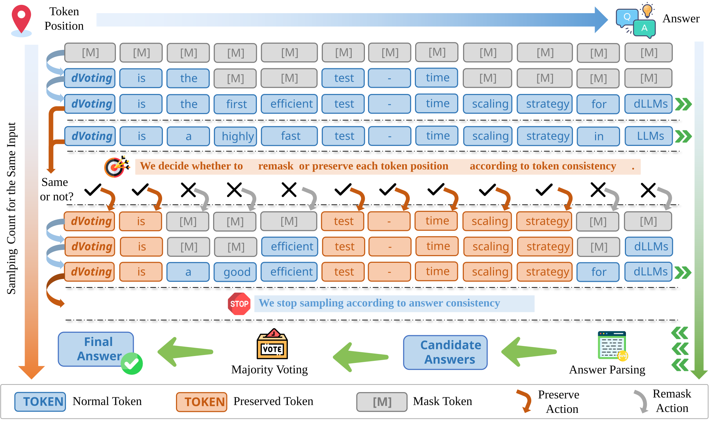

<div align="center">
      <h2><b> dVoting: Fast Voting for dLLMs </b></h2>
</div>

<div align="center">


<a href="todo" target="_blank"></a>

</div>

<div align="center">

<!-- **[<a href="https://huggingface.co/papers/2510.02240">HuggingFace Daily Paper</a>]** **[<a href="https://x.com/si_feng32704/status/1973968606468997410">Twitter</a>]** **[<a href="https://mp.weixin.qq.com/s/jTnrxfZ7Secq1-ZO1mDMyg">机器之心</a>]** -->

</div>

This repository is for our paper:

> **[dVoting: Fast Voting for dLLMs](todo)** \
> [Sicheng Feng](https://fscdc.github.io/)<sup>1</sup>, [Zigeng Chen](https://czg1225.github.io/chenzigeng99/)<sup>1</sup>, [Xinyin Ma](https://horseee.github.io/)<sup>1</sup>, [Gongfan Fang](https://fangggf.github.io/)<sup>1</sup>, [Xinchao Wang](https://sites.google.com/site/sitexinchaowang/)<sup>1,*</sup> \
> <sup>1</sup>National University of Singapore, Singapore \
> <sup>∗</sup>Corresponding author: xinchao@nus.edu.sg

---

>🙋 Please let us know if you find a mistake or have any suggestions!
>
>🌟 If you find this resource helpful, please consider to star this repository and cite our [research](#citation)!

<p align="center">

</p>

## Updates

- 2026-01-26: 🚀 We release code for [dVoting](todo)!

## Usage

### 1. Install dependencies

If you face any issues with the installation, please feel free to open an issue. We will try our best to help you.

```bash
pip install -r requirements.txt
```

### 2. Download datasets and models

You can download GSM8K & MATH500 & GPQA & ARC-C & MMLU / LLaDA-8B-Instruct & GSAI-ML/LLaDA-1.5 & Dream-org/Dream-v0-Instruct-7B for evaluation by directly running the scripts or from HuggingFace.

### 3. Evaluation

We follow [simple-evals](https://github.com/openai/simple-evals) to evaluate our method on the benchmarks. We provide some scripts to facilitate the evaluation.

```bash
# baseline (majority voting or HEX)
bash scripts/run_baseline.sh # llada / llada1.5
bash scripts/run_baseline_dream.sh # dream

# dVoting
bash scripts/run_dvoting.sh # llada / llada1.5
bash scripts/run_dvoting_dream.sh # dream
```

## Acknowledgement

We thank the authors of [LLaDA](https://github.com/ML-GSAI/LLaDA), [Dream](https://github.com/DreamLM/Dream), [dKV-Cache](https://github.com/horseee/dkv-cache), [simple-evals](https://github.com/openai/simple-evals) for open-sourcing their codebases. 

## Citation

If you find this paper useful in your research, please consider citing our papers:

```bibtex
todo
```
